<h1 style="display:none">Flower Garden</h1>
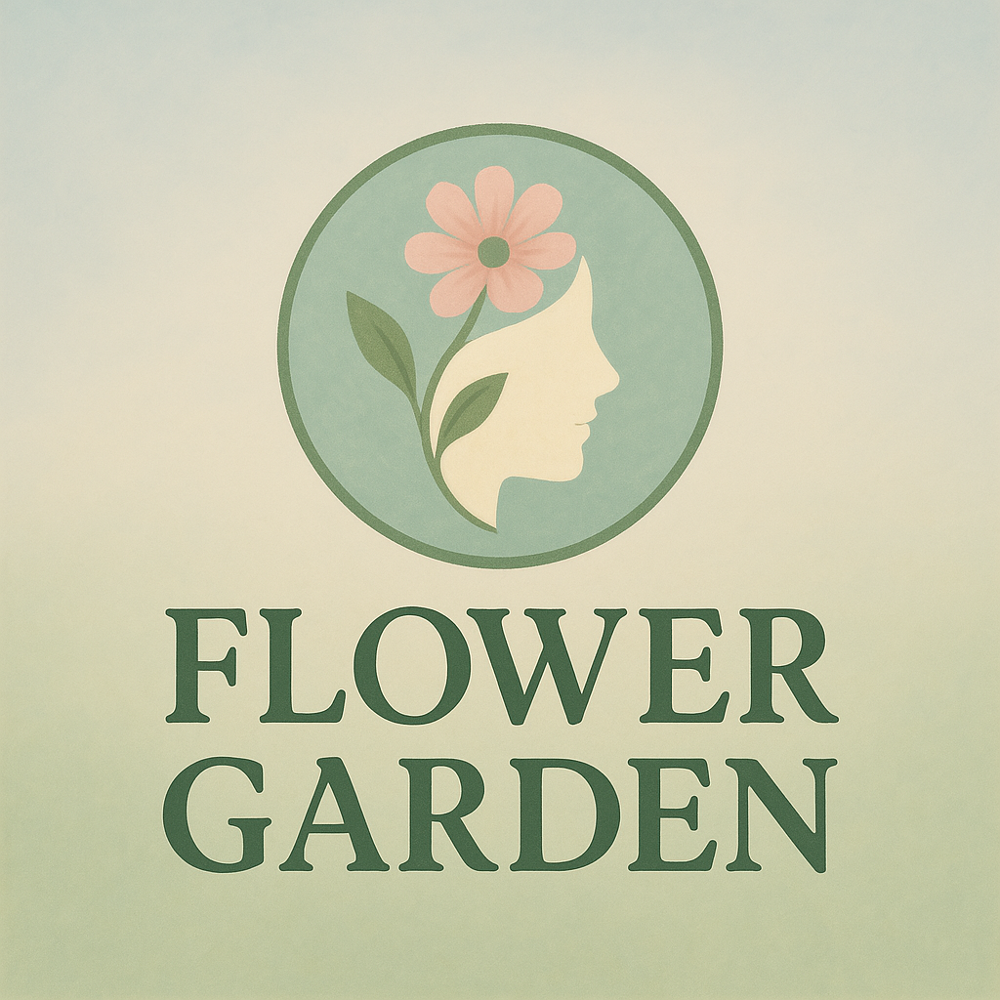

# Overview
Flower Garden is my first individual project for Code Institute's AI Augmented Full Stack Software Development Bootcamp. Flower Garden is a simple static website created with HTML, CSS and Bootstrap that aims to provide general Safeguarding advice and support through counselling.

The live website can be visited here.

## Table of Contents

- [Flower Garden](#flower-garden)
  - [Overview](#overview)
  - [Table of Contents](#table-of-contents)
- [Project Planning](#project-planning)
  - [User Stories](#user-stories)
  - [UX Design](#ux-design)
    - [Colours](#colours)
    - [Images](#images)
    - [Fonts](#fonts)
    - [Wireframes](#wireframes)
- [Features](#features)
  - [Navigation](#navigation)
  - [Modal](#modal)
  - [Contact](#contact)
  - [Responsiveness](#responsiveness)
- [Deployment](#Deployment)
- [AI Implementation](#ai-implementation)
- [Testing](#testing)
- [Credits](#credits)

  

# Project Planning

## User Stories

User stories have been issued and further detailed under the project board, and can be summarised as follows:

- As a first-time visitor, I need easy navigation and a user-friendly design, including a responsive layout for my device, so I can find information quickly and efficiently without frustration.

- As a vulnerable person, I want to see sensitive language and soft, calming imagery that makes me feel safe.

- As an adult experiencing abuse, I want the website to provide discreet help, so that I can take steps toward safety without fear of retaliation or scrutiny.

- As a concerned friend, I want to understand the warning signs of radicalization and abuse, so that I can support my loved ones and know when and how to intervene.

- As an educator/business professional, I want materials on safeguarding that I can share with my students/workers, so that I can proactively prevent radicalization and abuse.

- As a fellow survivor of abuse, I want a way to anonymously contribute to how safeguarding helped me, so that I can help keep people safe without putting myself in the public eye.

- As an inexperienced user, I want to see the services offered by the website delivered plainly and made easy to find. I want all mentioned services to be visible and accessible from the homepage.

## UX Design

### Colours

For colour, I opted to go with soft, natural colours to emphasize both the theming of flowers and the gentle approach needed to handle vulnerable and fragile individuals. I wanted the website to exude a mature, sensible feeling while still approaching a difficult topic with a general aura of ease and comfort.

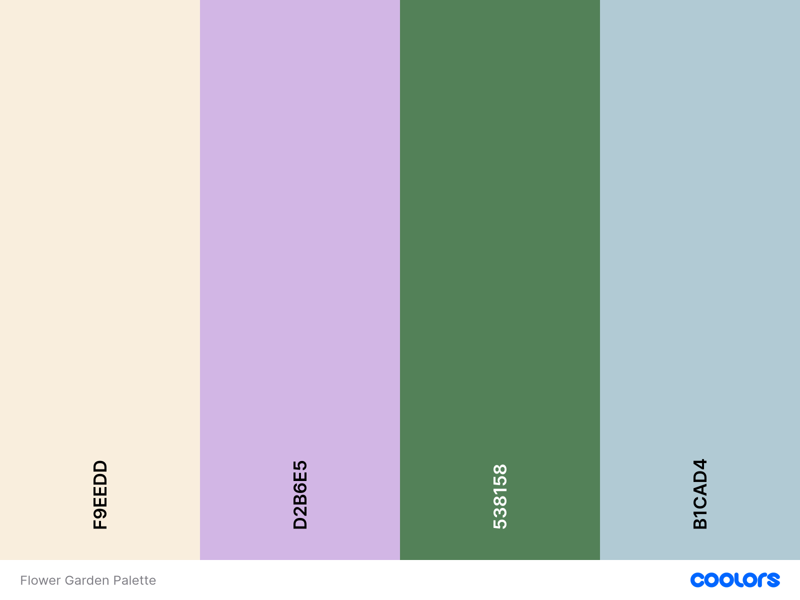

### Images

I wanted the imagery to invoke feelings of calm and serenity, so in fitting with the theme I selected mostly natural backgrounds with flowers under a warm sunset or a light secluded mist. I only introduced animals or silhouettes of people into the images if I felt it was important to convey a feeling of togetherness and community in that feature of the site.

I mainly used Microsoft Copilot to generate AI imagery for the site, and used Fontawesome to generate social media and navigation iconography. The images were heavily directed without much freedom on part of the AI to experiment in order to keep all imagery across the site cohesive and familiar.

### Fonts

Embedded from Google fonts, I ended up choosing a mixture of "Annie Use Your Telescope" and "Nothing You Could Do" to generate headings, titles and quotes, with "Zain" for most of the important paragraphs. This setup was chosen to incite an atmosphere of ease and relaxation, with handwritten fonts that still exuded a certain maturity heading the more "serious" dialogue displayed with Zain for readibility and ease of use.

### Wireframes

The wireframes used for this project were created in Balsamiq, and focus on outlining very key features with minimal clutter to allow for experimentation.

**Desktop Wireframes**

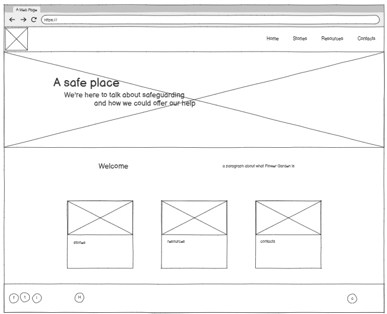
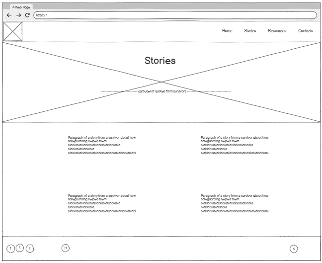
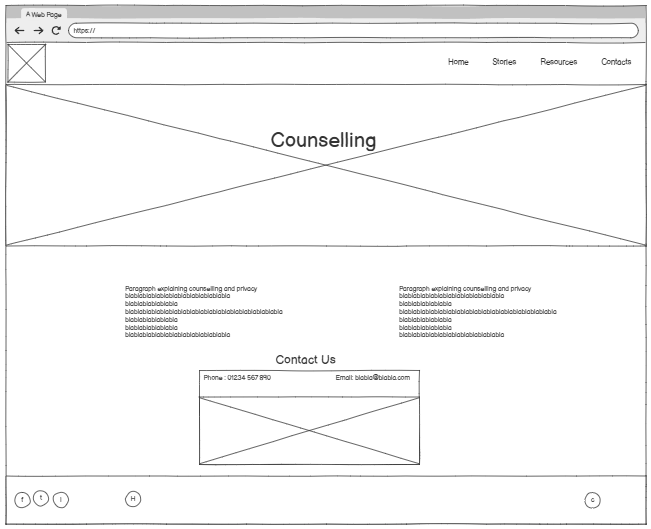

  

**Tablet Wireframes**

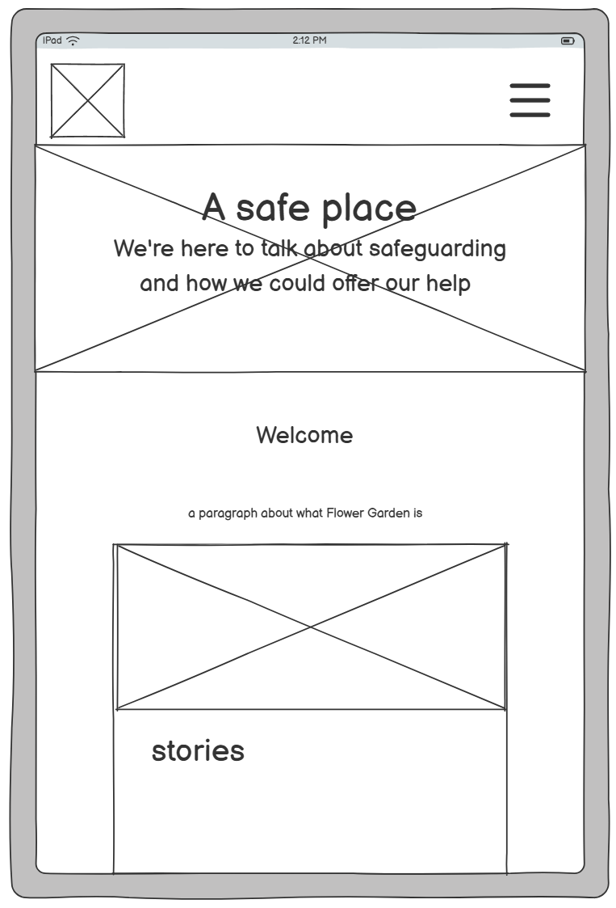 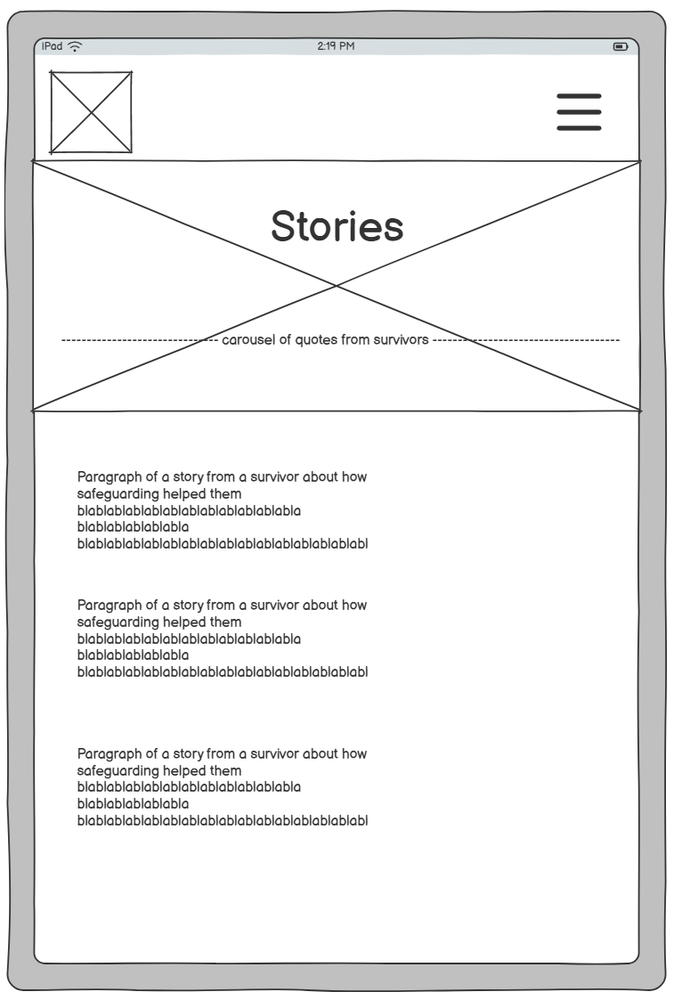

  

**Phone Wireframes**

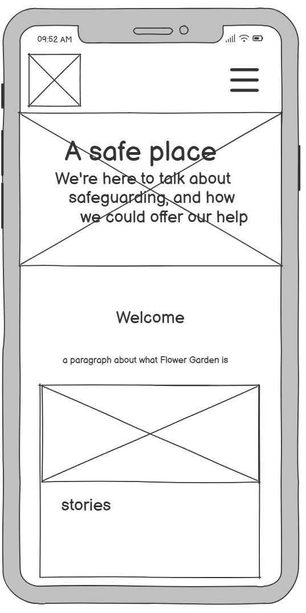 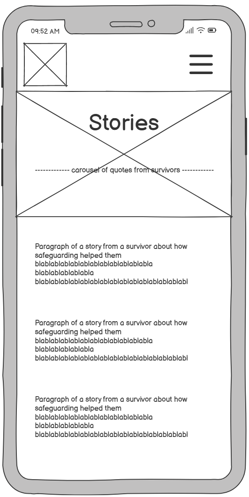

  

# Features

## Navigation

The navbar was made using Bootstrap, and is constructed to collapse on smaller screens into an expandable component. The logo has been incorporated into the navbar and functions as a link to the homepage. This navbar is present on all pages and contains links to every page on the website.

There are also Bootstrap cards on the base of the homepage that function as fleshed out links to other areas of the website, as the homepage doesn't serve any other immediate function than that of a hub.

The bottom of each page features a Footer that carries links to social media, as well as another link to the homepage in the center.

## Modal

The Stories page of the website features a functional modal to input your (optional) name and age, along with your safeguarding survival story. The story has been made a required input, while the name/age is not. The modal has been made to output to Code Institute's Formdump website as a means of testing.

## Contact

The Counselling page features a contact box with a fake phone number, fake hours of operation and a fake address. It also features an "Email us" button that directs the user to their default email service, preparing a fake email recipient.

## Responsiveness

The website has been primarily made with Bootstrap, resulting in easily implemented responsive functionality with little necessity for media queries. However, in some areas responsiveness did have to be manually adjusted using CSS and media queries to ensure the final product was as close to the vision as possible.

  

# Deployment

This Github project was created completely from scratch, utilising addons such as Live Preview and Live Server to track website functionality and progress. 

I also did not deploy the project at all during development, trusting entirely on Live Server and preview addons to carry me through as I had very little in the way of scripted elements.

# Testing

Debugging was carried out regularly throughout development, either using AI or online code validators such as W3 Nu and W3C Jigsaw. Final checks after completion revealed no issues.

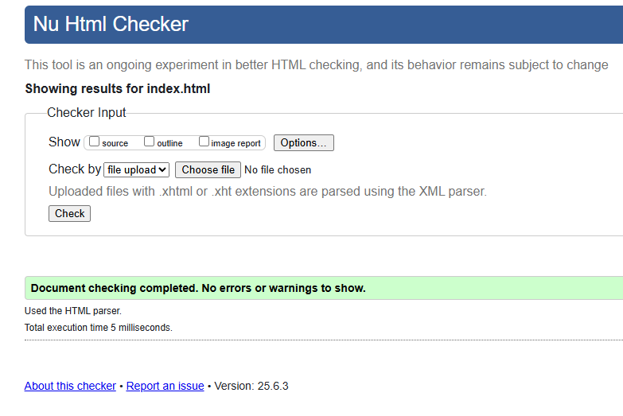

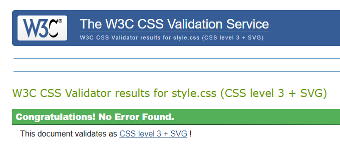